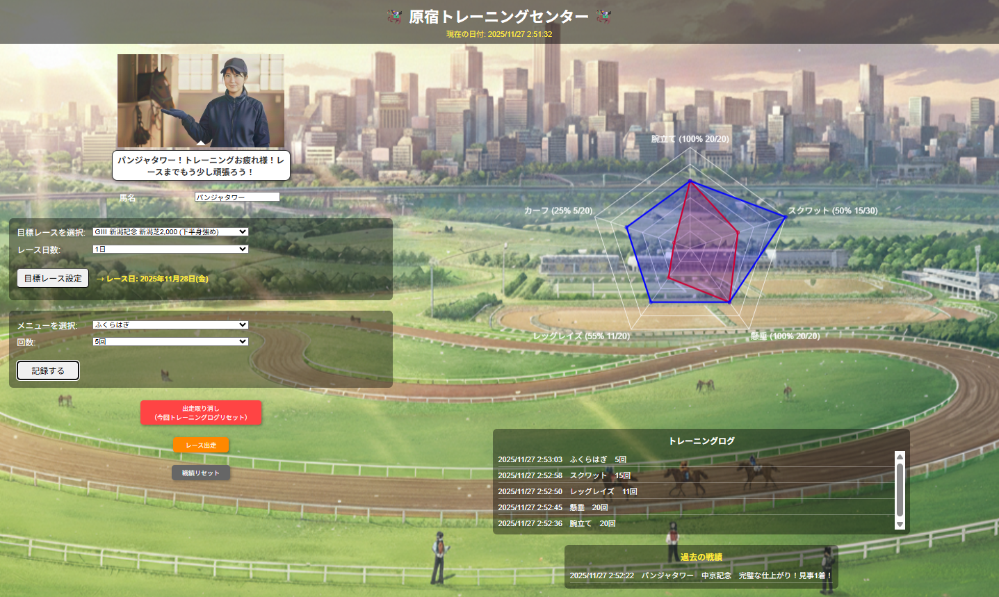

# ①原宿トレーニングセンター

## ②説明
- 競走馬になりきって目標レースに向かってトレーニングをしよう！
- 目標レースごとに各トレーニング種目の達成目標が設定されています！目標レースとレースまでの日数を設定しましょう
- 運動をしたら記録していきます。レース日までに目標回数をこなしましょう！
- レース日が来たら出走しましょう！運動目標の達成度合いによりレース結果が変わります

## ③アプリのデプロイURL
https://ynproject.github.io/XXXXXXX

## ④アプリのログイン用IDまたはPassword（ある場合）
- ID: 今回無し
- PW: 今回無し

## ⑤工夫した点・こだわった点
- 運動実績を積み上げて記録し、目標と併記してグラフ化したこと
- 目標達成と競馬のレースを組み合わせて少しゲーム性を取り入れたこと
- リセットの処理を入れて繰り返し使えるようにしました

## ⑥難しかった点・次回トライしたいこと（又は機能）
- リセットの処理を入れるのが難しかったです。
- チャートのデザイン変更やレスポンシブがうまくいかず、今後調べたい

## ⑦フリー項目（感想、シェアしたいこと等なんでも）
- グラフはこちらを使いました→　https://www.chartjs.org/docs/latest/getting-started/

プレイイメージです

|:-------------:|:--------------------:|
|  |  |
